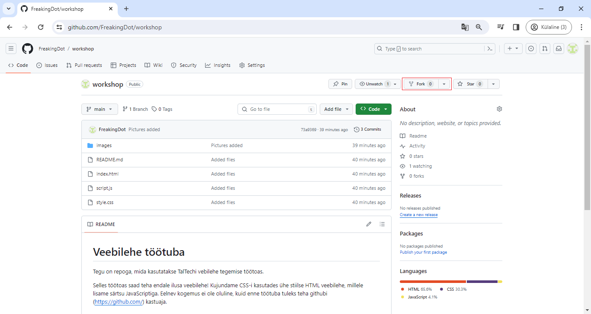
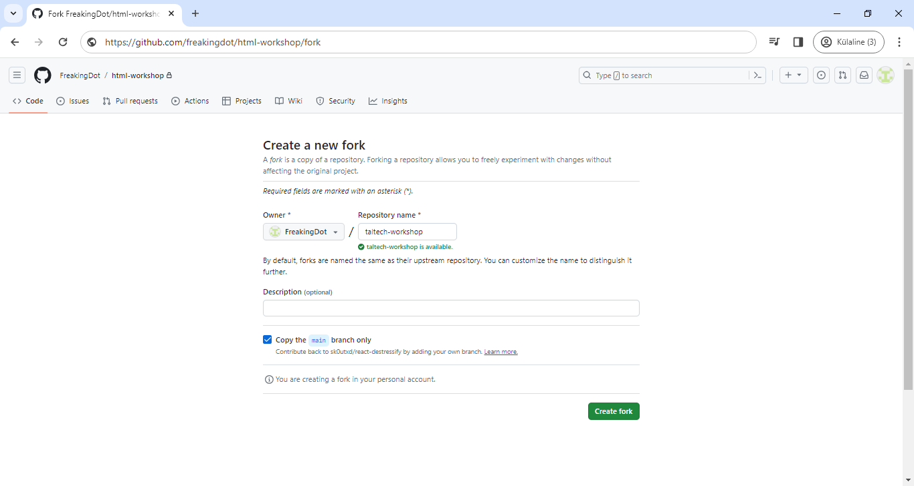

# Veebilehe töötuba

Kuidas mall välja näeb? [https://taltech-coding.github.io/html-workshop/](https://taltech-coding.github.io/html-workshop/)

Tegu on repoga, mida kasutatakse TalTechi vebilehe tegemise töötoas.

Selles töötoas saad teha endale ilusa veebilehe! Kujundame CSS-i kasutades ühe stiilse HTML veebilehe,
millele lisame särtsu JavaScriptiga. Eelnev kogemus ei ole oluline,
kuid enne töötuba tuleks teha githubi (https://github.com/) kastuaja.

## Kuidas malli kasutada?

1. vali "Fork"

2. Saad ise lisada repository'le nime ning vajuta _create fork_

3. Peale natukest laadimist peaks ette tulema sinu uus repo.

## Repos on:
* index.html - veebilehe HTML mall
* style.css - veeblehe CSS-i mall
* images kaust, kus on pildid, mida index.html-is kasutatakse
* README.md koos seal kasutatavate piltidega (tutorial_img_1.png ja tutorial_img_2.png)
* given_template.jpg, kus on kirjas, mida on vaja teha.

## Materjalid ja lingid
- [veebileht](https://htmldoc.pages.taltech.ee/)
- [slaidid](https://docs.google.com/presentation/d/1IIEsvgF68YxoXBrTw4Q3hZHinvBzRxxvQ3_BGsVhlcY/edit?usp=sharing) 
